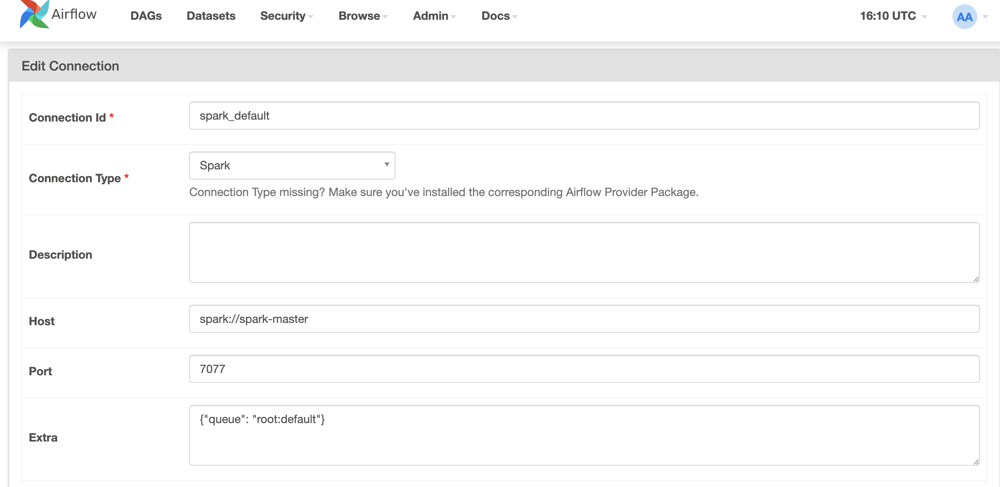
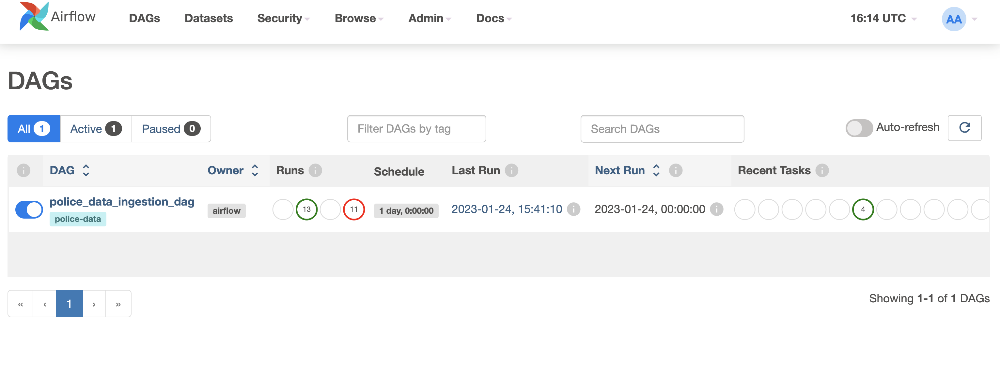
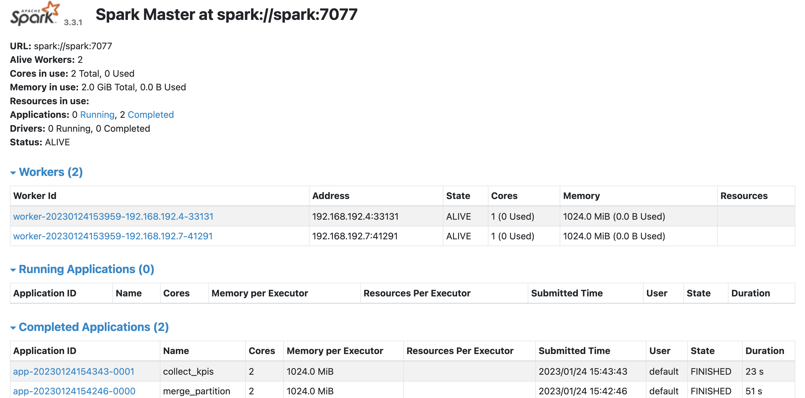
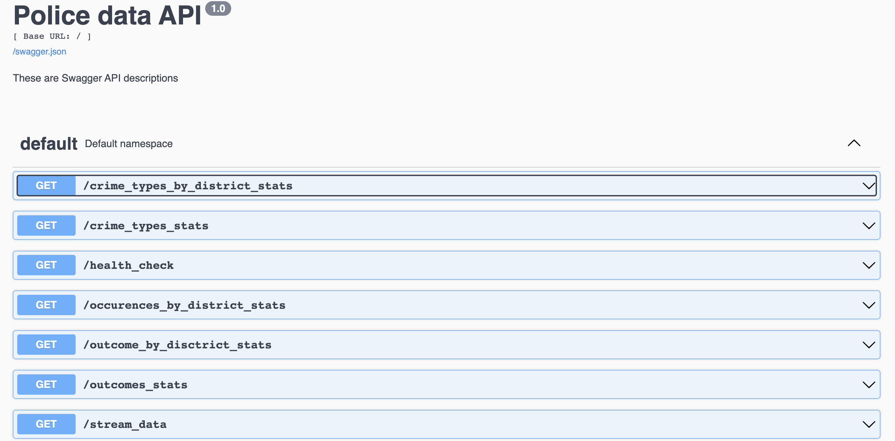

### Requirements

To use the code you have Docker and Docker Compose installed

### Project structure

1. Entry point of the project is `dags` folder. This is where all Airflow DAGs reside

2. `datasets` is a shared folder, where data is downloaded, reformated, merged and statistics calculated. You can check data here after tasks run in Airflow
 
 3. `logs` and `plugins` folders which Airflow uses

 4. `postgres-db-volume` volume used by Postgres

 5. `scripts` this is how Airflow is started

 6. `spark` Spark scripts used by Airflow tasks

 7. `kpi_research.ipyb` notebook for basic data research and data experiments. Data research was done before statistics calculation in order to find issues, duplicates in data and ways how ot fix it


### Setup 

 
  1. In project's root folder build whole project first:
     ```shell
     docker-compose build --no-cache 
     ```
   
     

 2. Initialize the Airflow scheduler, DB, and other config
    ```shell
    docker-compose up airflow-init
    ```

 3. After the build start up the all the services from the container:
    ```shell
    docker-compose up -d
    ```

 4. Login to Airflow web UI on `localhost:8080` with default creds: `airflow/airflow`

 5. To be able to use Spark Operator in Airflow, you have to add Spark Hook on Admin->Connections->Add section in Airflow Admin.
    

 6. Now manually run main DAG on the Web Console, which will prepare data and statistics. By default DAG is not running!
    

 7. Unfortunalety, Spark image created by **bitnami** doesn't have Spark Web UI, but runs Spark Master UI on default port **8080**. This port is conflicting with Airflow default's, so I reconfigured it to **7073**. Run `localhost:7073` if you need **Spark Master UI**

    

  8. When DAG complets execution and no errors seen in logs, you can run Web UI to check Police data statistics. Run `localhost:5055`. Swagger page is self explanatory, so feel free to run any endpoint. **Note**, running `/stream_data` starts downloading the whole dataset

      

 
 9. On finishing your run or to shut down the container/s:
    ```shell
    docker-compose down    
    ```    

### Future Enhancements
* In some places code is self testing, but more tests for ETL pipeline couldbe added
* For simplicity, file pathes between tasks in DAG are initiated in advance, but we can pass them as XComs
* Config files should be added to move out static content from source files


